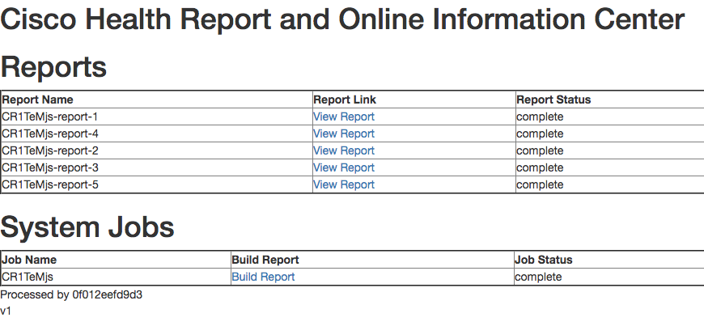
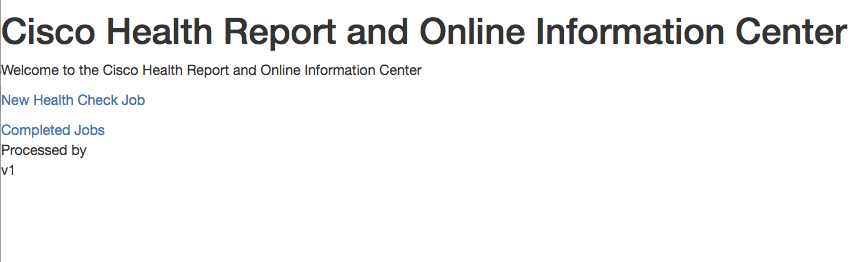

# CHROnIC Portal

Cisco Health Reports and Online Information Center is a plug-able web app to help visualize and maintain device's support by providing various health reports.

CHROnIC Portal provides a web interface to the CHROnIC System.

## Example Screenshots



# Installation
CHROnIC Portal is built using Python 3.5 and is packaged with a Dockerfile for easy builds and deployments

## Environment
CHROnIC Portal expects the following environment variables to be set:

CHRONICBUS describes the base url of the CHROnIC Bus system used as the centralized message bus and DB

```
CHRONICBUS
```


## Usage
### Python
```
export CHRONICBUS=<url>
export CHRONICUCS=<url>
python3 main.py
```

or

### Docker
```
docker build -t chronic-portal
docker run -d -e "CHRONICBUS=<url>" -e "CHRONICUCS=<url"> chronic-portal
```


